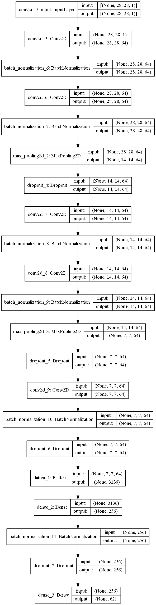
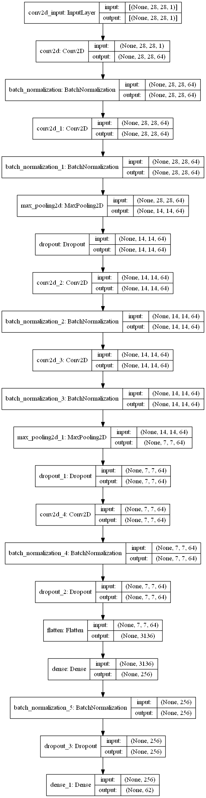
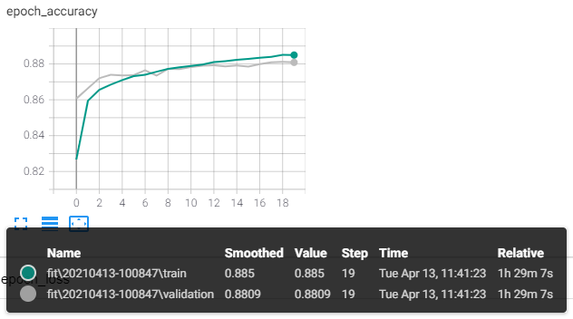
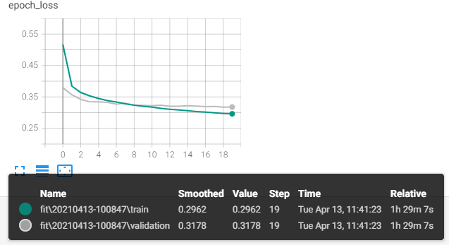
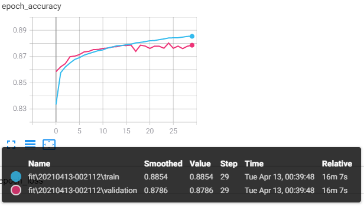
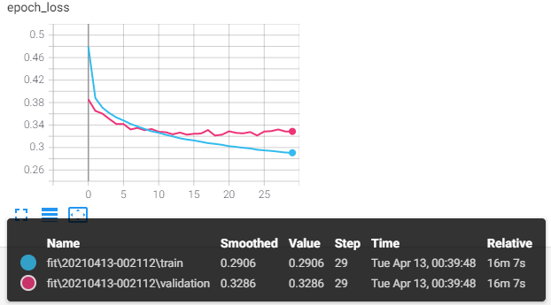
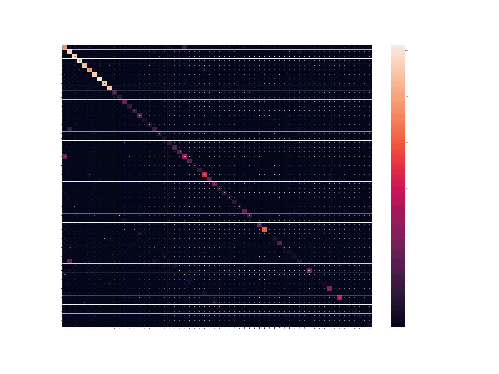

# 深度學習:理論及應用 HW3 - EMNIST CNN Classification
##### 學號: 109971014
## Code
#### Using Tensorflow
* /HW3.ipynb
## Report

### \#Model Baseline
#### Baseline Model

##### Parameters
```
model.add(Conv2D(filters = 64, kernel_size = (5,5),padding = 'Same', activation ='relu', input_shape = (28,28,1)))
model.add(BatchNormalization())

model.add(Conv2D(filters = 64, kernel_size = (5,5),padding = 'Same', activation ='relu'))
model.add(BatchNormalization())

model.add(MaxPool2D(pool_size=(2,2)))
model.add(Dropout(0.25))

model.add(Conv2D(filters = 64, kernel_size = (3,3),padding = 'Same', activation ='relu'))
model.add(BatchNormalization())

model.add(Conv2D(filters = 64, kernel_size = (3,3),padding = 'Same', activation ='relu'))
model.add(BatchNormalization())
model.add(MaxPool2D(pool_size=(2,2), strides=(2,2)))
model.add(Dropout(0.25))

model.add(Conv2D(filters = 64, kernel_size = (3,3), padding = 'Same',  activation ='relu'))
model.add(BatchNormalization())
model.add(Dropout(0.25))

model.add(Flatten())
model.add(Dense(256, activation = "relu"))
model.add(BatchNormalization())
model.add(Dropout(0.25))

model.add(Dense(62, activation = "softmax"))

model.compile(loss='categorical_crossentropy', optimizer='adam', metrics=['accuracy'])

model.fit(train_data, train_label, epochs=20, batch_size=512, verbose=2, shuffle=True, validation_split=0.1)
```
##### Result
> Epoch: 20, Loss: 0.3840, Accuracy: 0.8639

### \#Model Improvement
#### 提升準確率之思路
> 增加 Layer 的數量以及 Cell 的數量

#### Improvement Model 1

##### Parameters
```
model_2.add(Dense(1568, input_shape=(784,), activation='relu'))
model_2.add(BatchNormalization())
model_2.add(Dropout(0.3))
model_2.add(Dense(1568, activation='relu'))
model_2.add(BatchNormalization())
model_2.add(Dropout(0.3))
model_2.add(Dense(784, activation='relu'))
model_2.add(BatchNormalization())
model_2.add(Dropout(0.3))
model_2.add(Dense(392, activation='relu'))
model_2.add(BatchNormalization())
model_2.add(Dropout(0.3))
model_2.add(Dense(196, activation='relu'))
model_2.add(BatchNormalization())
model_2.add(Dropout(0.3))
model_2.add(Dense(62, activation='softmax'))

opt = Adam(learning_rate=0.005)
model_2.compile(loss='CategoricalCrossentropy', optimizer=opt, metrics=['accuracy'])

model_2.fit(train_data, train_label, epochs=30, batch_size=128, shuffle=True, validation_split=0.1)
```
##### Result
> Epoch: 30, Loss: 0.3833, Accuracy: 0.8652

##### Note
> 對比 Baseline model，多加一層 & 加大一倍的連結網路數量，以及將**Dropout**從 0.2 調整至 0.3，Batch_size 調整為**128**
> 準確率提升 **0.0013**

#### Improvement Model 2

##### Parameters
```
model_3.add(Dense(1568, input_shape=(784,), activation='relu'))
model_3.add(BatchNormalization())
model_3.add(Dropout(0.3))
model_3.add(Dense(3136, activation='relu'))
model_3.add(BatchNormalization())
model_3.add(Dropout(0.3))
model_3.add(Dense(3136, activation='relu'))
model_3.add(BatchNormalization())
model_3.add(Dropout(0.3))
model_3.add(Dense(1568, activation='relu'))
model_3.add(BatchNormalization())
model_3.add(Dropout(0.3))
model_3.add(Dense(784, activation='relu'))
model_3.add(BatchNormalization())
model_3.add(Dropout(0.3))
model_3.add(Dense(392, activation='relu'))
model_3.add(BatchNormalization())
model_3.add(Dropout(0.3))
model_3.add(Dense(196, activation='relu'))
model_3.add(BatchNormalization())
model_3.add(Dropout(0.3))
model_3.add(Dense(62, activation='softmax'))

opt = Adam(learning_rate=0.005)
model_3.compile(loss='CategoricalCrossentropy', optimizer=opt, metrics=['accuracy'])
model_3.summary()

model_3.fit(train_data, train_label, epochs=20, batch_size=128, shuffle=True, validation_split=0.1)
```
##### Result
> Epoch: 20, Loss: 0.4076, Accuracy: 0.8643

##### Note
> 對比 Improvement model 2，多加兩層 & 加大一倍的連結網路數量
> 準確率降低 **0.0009**

### \#Training Procedure
#### Baseline Model



#### Improvement_1 Model



#### Improvement_2 Model


### \#Error Analysis
* Using ***Improvement_1 Model***


#### CONCLUSION
> * **數字'1'** 辨識成 **英文小寫'l'** 達 **1922** 個樣本<br>
> * **數字'0'** 辨識成 **英文大寫'O'** 達 **1975** 個樣本<br>
> * **數字'1'** 辨識成 **英文大寫'I'** 達 **852** 個樣本<br>
> * **英文大寫'I'** 辨識成 **數字'1'** 達 **295** 個樣本<br>
> * **英文大寫'O'** 辨識成 **數字'0'** 達 **754** 個樣本<br>
> * **英文大寫'S'** 辨識成 **數字'5'** 達 **509** 個樣本<br>
> * **英文大寫'M'** 辨識成 **英文小寫'm'**  達 **459** 個樣本<br>
> * **英文大寫'U'** 辨識成 **英文小寫'u'**  達 **427** 個樣本<br>
> * **英文大寫'S'** 辨識成 **英文小寫's'**  達 **403** 個樣本<br>
