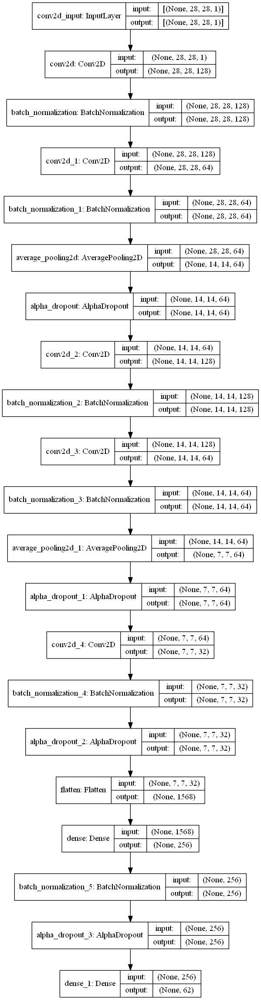

# 深度學習:理論及應用 HW3 - EMNIST CNN Classification
##### 學號: 109971014
## Code
#### Using Tensorflow
* /HW3.ipynb
## Report
> Best Accuracy: **0.8811**<br>
### \#Model Baseline
#### Baseline Model (Best Accuracy)

##### Parameters
```
model.add(Conv2D(filters = 64, kernel_size = (5,5),padding = 'Same', activation ='relu', input_shape = (28,28,1)))
model.add(BatchNormalization())

model.add(Conv2D(filters = 64, kernel_size = (5,5),padding = 'Same', activation ='relu'))
model.add(BatchNormalization())

model.add(MaxPool2D(pool_size=(2,2)))
model.add(Dropout(0.25))

model.add(Conv2D(filters = 64, kernel_size = (3,3),padding = 'Same', activation ='relu'))
model.add(BatchNormalization())

model.add(Conv2D(filters = 64, kernel_size = (3,3),padding = 'Same', activation ='relu'))
model.add(BatchNormalization())
model.add(MaxPool2D(pool_size=(2,2), strides=(2,2)))
model.add(Dropout(0.25))

model.add(Conv2D(filters = 64, kernel_size = (3,3), padding = 'Same',  activation ='relu'))
model.add(BatchNormalization())
model.add(Dropout(0.25))

model.add(Flatten())
model.add(Dense(256, activation = "relu"))
model.add(BatchNormalization())
model.add(Dropout(0.25))

model.add(Dense(62, activation = "softmax"))

model.compile(loss='categorical_crossentropy', optimizer='adam', metrics=['accuracy'])

model.fit(train_data, train_label, epochs=20, batch_size=512, verbose=2, shuffle=True, validation_split=0.1)
```
##### Result
> Epoch: 20, Loss: 0.3160, Accuracy: 0.8811

### \#Model Improvement

#### Improvement Model 1

##### Parameters
```
model_2.add(Conv2D(6, kernel_size=5, strides=1, padding = 'Same', activation ='relu', input_shape = (28,28,1)))
model_2.add(BatchNormalization())

model_2.add(Conv2D(16, kernel_size=5, strides=1, padding = 'Same', activation ='relu'))
model_2.add(BatchNormalization())

model_2.add(AveragePooling2D(pool_size=2, strides=2, padding='valid'))
model_2.add(Dropout(0.3))

model_2.add(Conv2D(32, kernel_size=5, strides=1, padding = 'Same', activation ='relu'))
model_2.add(BatchNormalization())

model_2.add(Conv2D(64, kernel_size=5, strides=1, padding = 'Same', activation ='relu'))
model_2.add(BatchNormalization())
model_2.add(AveragePooling2D(pool_size=2, strides=2, padding='valid'))
model_2.add(Dropout(0.3))

model_2.add(Conv2D(128, kernel_size=5, strides=1, padding = 'Same',  activation ='relu'))
model_2.add(BatchNormalization())
model_2.add(Dropout(0.3))

model_2.add(Flatten())

model_2.add(Dense(256, activation = "relu"))
model_2.add(BatchNormalization())
model_2.add(Dropout(0.25))

model_2.add(Dense(62, activation = "softmax"))

opt = Adam(learning_rate=0.005)
model_2.compile(loss='CategoricalCrossentropy', optimizer=opt, metrics=['accuracy'])

model_2.fit(train_data, train_label, epochs=30, batch_size=512, shuffle=True, validation_split=0.1)
```
##### Result
> Epoch: 30, Loss: 0.3243, Accuracy: 0.8786

##### Note
> 將 MaxPool2D 改為 AveragePooling2D <br>
> 增加 Dropout 的數量 ***(+0.05)*** <br>
> Convolution 的 Filter 與 kernel 數量**調低** <br>
> 準確率下降 **0.0025**

### \#Training Procedure
#### Baseline Model


#### Improvement_1 Model


### \#Error Analysis
* Using ***Baseline Model***


#### CONCLUSION
**僅列出誤判大於100的數據**

正確值         | 預測值   | 數量
------------  | ----  | ---  |
英文大寫'O' | 數字'0' | 1036 
英文大寫'I' | 數字'1' | 272 
英文小寫'l' | 數字'1' | 269 
英文大寫'S' | 數字'5' | 224 
英文小寫'c' | 英文大寫'C' | 123 
數字'1' | 英文大寫'I' | 747 
英文小寫'l' | 英文大寫'I' | 179 
英文小寫'm' | 英文大寫'M' | 105 
數字'0' | 英文大寫'O' | 1660 
數字'5' | 英文大寫'S' | 152 
英文大寫'C' | 英文小寫'c' | 340 
英文大寫'F' | 英文小寫'f' | 256 
數字'9' | 英文小寫'g' | 133 
數字'1' | 英文小寫'i' | 104 
英文大寫'K' | 英文小寫'k' | 153 
數字'1' | 英文小寫'l' | 1585 
英文大寫'I' | 英文小寫'l' | 292 
英文大寫'M' | 英文小寫'm' | 327 
數字'0' | 英文小寫'o' | 211 
英文大寫'O' | 英文小寫'o' | 230 
英文大寫'P' | 英文小寫'p' | 219 
數字'9' | 英文小寫'q' | 193 
英文大寫'S' | 英文小寫's' | 378 
英文大寫'U' | 英文小寫'u' | 392 
英文大寫'V' | 英文小寫'v' | 242 
英文大寫'W' | 英文小寫'w' | 172 
英文大寫'X' | 英文小寫'x' | 134 
英文大寫'Y' | 英文小寫'y' | 194 
