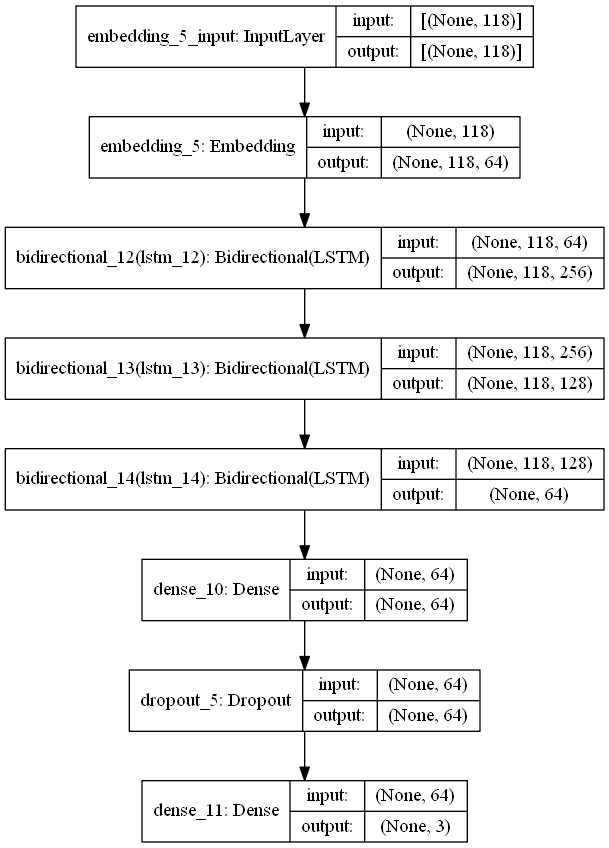
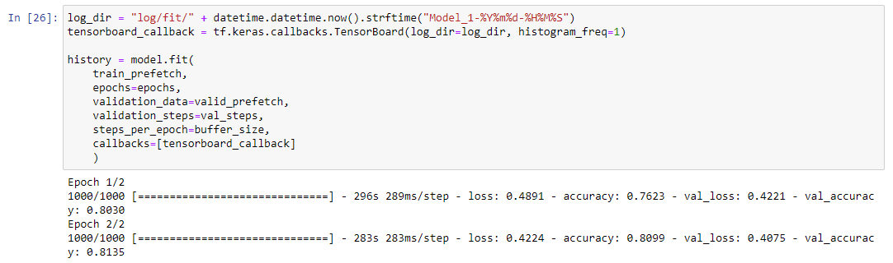
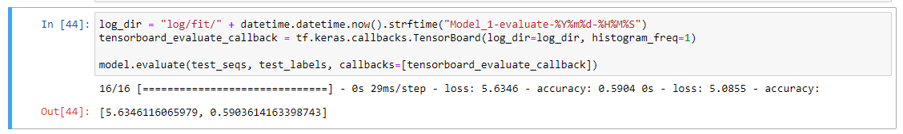
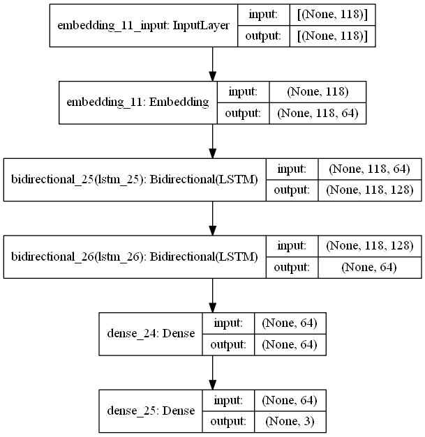
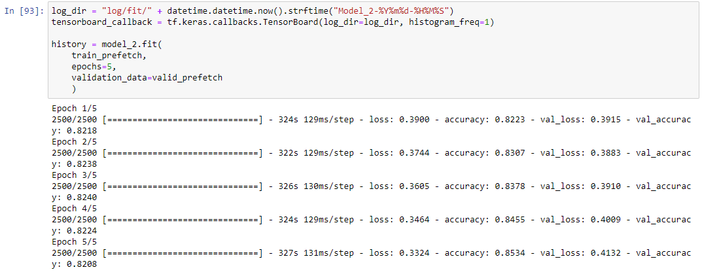
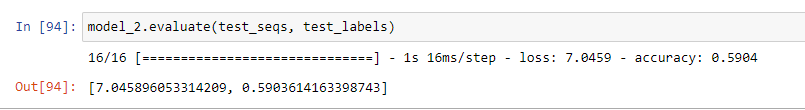
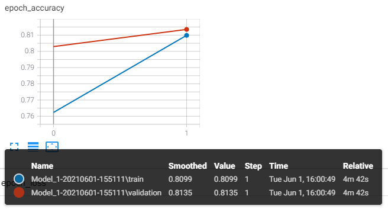
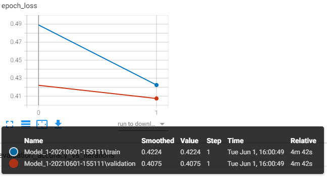
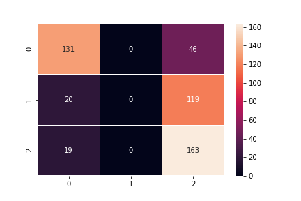

# 深度學習:理論及應用 HW4 - Sentiment Classification - RNN
##### 學號: 109971014
## Code
#### Using Tensorflow
* /HW4.ipynb
## Report
> Best Accuracy with Test data: **0.5904**<br>
### \#Model Baseline
#### Baseline Model (Best Accuracy)

##### Parameters
```
model = tf.keras.Sequential([
    Embedding(vocab_size, embedding_dim, input_length=maxlength),
    Bidirectional(LSTM(128,  return_sequences=True)),
    Bidirectional(LSTM(64,  return_sequences=True)),
    Bidirectional(LSTM(32)),
    Dense(64, activation='relu'),
    Dropout(0.5),
    Dense(3, activation='softmax')
])

model.compile(optimizer='adam',
              loss='categorical_crossentropy',
              metrics=['accuracy'])
              
model.fit(
    train_prefetch,
    epochs=epochs,
    validation_data=valid_prefetch,
    validation_steps=val_steps,
    steps_per_epoch=buffer_size,
    callbacks=[tensorboard_callback]
    )
```
##### Result
> Epoch: 2, Loss: 0.4224, Accuracy: 0.8099, val_loss: 0.4075, val_accuracy: 0.8135

##### Training Screen Capture

##### Testing Screen Capture


### \#Model Improvement

#### Improvement Model

##### Parameters
```
model_2 = tf.keras.Sequential([
    Embedding(vocab_size, embedding_dim, input_length=maxlength),
    Bidirectional(LSTM(64,  return_sequences=True)),
    Bidirectional(LSTM(32)),
    Dense(64, activation='relu'),
    Dense(3, activation='sigmoid')
])

model_2.compile(optimizer='adam',
              loss='categorical_crossentropy',
              metrics=['accuracy'])
              
model_2.fit(train_prefetch, epochs=5, validation_data=valid_prefetch)              
```
##### Result
> Epoch: 5, Loss: 0.3324, Accuracy: 0.8534, val_loss: 0.4132, val_accuracy: 0.8208

##### Training Screen Capture

##### Testing Screen Capture


##### Note
> 將 MaxPool2D 改為 AveragePooling2D <br>
> 增加 Dropout 的數量 ***(+0.05)*** <br>
> Convolution 的 Filter 與 kernel 數量**調低** <br>
> 準確率下降 **0.0025**

### \#Training Procedure
#### Baseline Model




### \#Error Analysis
* Using ***Baseline Model***


#### CONCLUSION
因為 "testdata.manual.2009.06.14.csv" 測試資料中帶有中性詞分類(Label = 2)，且有139筆
訓練資料缺乏中性詞性的因素，難以準確判斷，故忽略中性資料的話最高準確率為 (497-139) / 497 = **0.7203**
